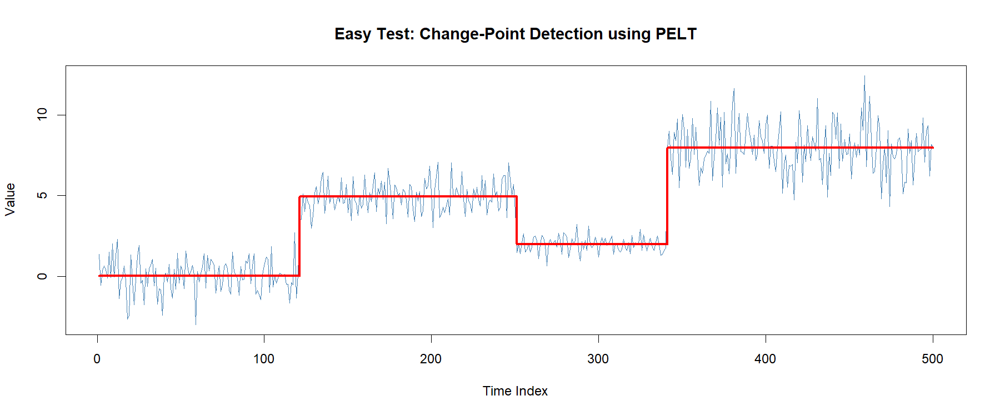
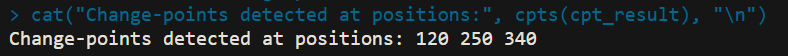

# Easy Test — Change-Point Detection using PELT

## Objective
Run a change-point detection algorithm on a simulated dataset and plot the results.

## Algorithm Used
- **PELT** (Pruned Exact Linear Time) via the `changepoint` R package

## Dataset
Simulated time series of 500 data points with 3 known change-points:
- Segment 1 (1–120): mean = 0, sd = 1
- Segment 2 (121–250): mean = 5, sd = 1
- Segment 3 (251–340): mean = 2, sd = 0.5
- Segment 4 (341–500): mean = 8, sd = 1.5

## Results
Change-points detected at positions: **120, 250, 340**

All 3 change-points were detected correctly.

## Files
| File | Description |
|------|-------------|
| `easy_test.R` | R script to run the analysis |
| `output/easy_test.png` | Plot of detected change-points |
| `output/easy_test_output.png` | Screenshot of console output |

## How to Run
```r
install.packages("changepoint")
source("easy_test.R")
```

## Output Plot


## Console Output

