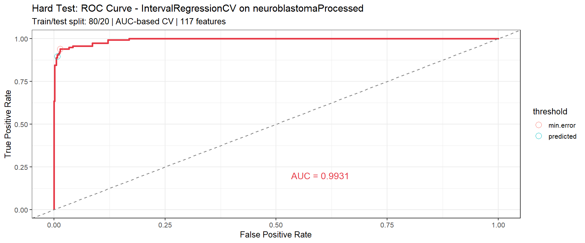
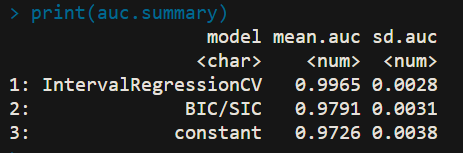

# Hard Test - IntervalRegressionCV with K-Fold CV on neuroblastomaProcessed

## Objective
Run `penaltyLearning::IntervalRegressionCV` on the neuroblastoma dataset using 5-fold cross-validation on labels, compute test accuracy and ROC curves, and compare against BIC/SIC and constant penalty baselines.

## Dataset
`neuroblastomaProcessed` from the `penaltyLearning` package - the official pre-processed version of the neuroblastoma dataset with:
- **3418** labeled segmentation problems (profile × chromosome pairs)
- **117** features per problem (signal statistics, RSS, MSE, chromosome indicators)
- **2 target columns**: min and max log(penalty) intervals for weakly supervised learning

## Approach
Following the methodology from [Toby Hocking's supervised changepoint tutorial](https://tdhock.github.io/change-tutorial/Supervised.html):

- **5-Fold CV** - labeled sequences assigned to 5 folds; each fold used as test set once, trained on remaining 4 folds
- **IntervalRegressionCV** - L1-regularized interval regression with AUC-based CV model selection
- **BIC/SIC baseline** - unsupervised penalty using `log2.n` feature (log of number of data points)
- **Constant baseline** - best constant penalty chosen by maximizing correct labels on train set
- All 3 models compared on the same ROC plot per fold

## Results

### Per-Fold CV Accuracy (IntervalRegressionCV)
| Fold | Accuracy |
|------|----------|
| 1 | 98.39% |
| 2 | 98.10% |
| 3 | 97.37% |
| 4 | 97.95% |
| 5 | 98.98% |

### Mean AUC over 5 Folds
| Model | Mean AUC | SD |
|-------|----------|----|
| **IntervalRegressionCV** | **0.9965** | 0.0028 |
| BIC/SIC | 0.9791 | 0.0031 |
| Constant | 0.9726 | 0.0038 |

## Observations
- **IntervalRegressionCV** consistently outperforms both baselines across all 5 folds, confirming that supervised learning of the penalty function improves changepoint detection accuracy
- **BIC/SIC** is a strong unsupervised baseline but slightly less accurate than the learned model
- **Constant** penalty performs surprisingly well on this dataset, reflecting that the neuroblastoma data has a relatively consistent optimal penalty range
- The purple ROC curves (IntervalRegressionCV) hug the top-left corner across all folds, confirming near-perfect discrimination

## Files
| File | Description |
|------|-------------|
| `hard_test.R` | R script to run the full analysis |
| `output/hard_test_roc.png` | ROC curves for all 3 models across 5 folds |
| `output/hard_test_output.png` | Screenshot of AUC summary table |

## How to Run
```r
install.packages(c("penaltyLearning", "ggplot2", "data.table", "survival"))
source("hard_test.R")
```

## ROC Curves


## Console Output

