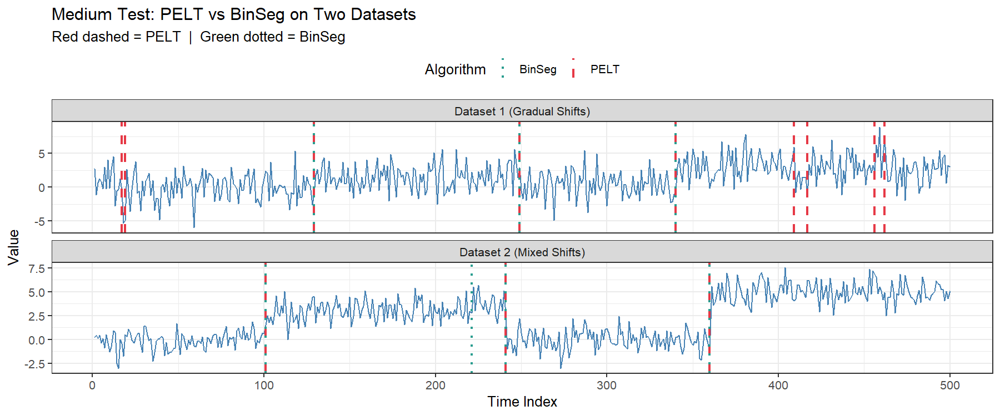
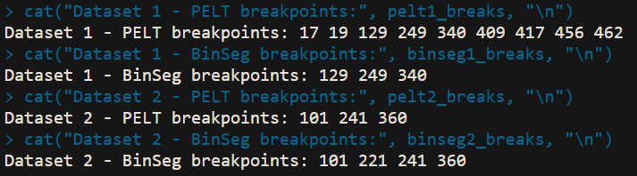

# Medium Test - Comparing PELT vs BinSeg on Two Datasets

## Objective
Run two change-point detection algorithms on two different datasets and create a plot showing the differences between them.

## Algorithms Used
- **PELT** (Pruned Exact Linear Time) via the `changepoint` package
- **BinSeg** (Binary Segmentation) via the `binsegRcpp` package

## Datasets

### Dataset 1 - Gradual Shifts
A 500-point simulated time series with subtle, noisy mean shifts designed so that PELT and BinSeg disagree:
- Segment 1 (1-120): mean = 0, sd = 2
- Segment 2 (121-250): mean = 1.5, sd = 2
- Segment 3 (251-340): mean = 0.5, sd = 2
- Segment 4 (341-500): mean = 3, sd = 2

High noise (sd = 2) with small mean differences causes PELT to oversegment while BinSeg remains conservative.

### Dataset 2 - Mixed Shifts
A 500-point simulated time series with a mix of strong and weak mean shifts:
- Segment 1 (1-100): mean = 0, sd = 1
- Segment 2 (101-180): mean = 3, sd = 1
- Segment 3 (181-240): mean = 3.5, sd = 1
- Segment 4 (241-360): mean = 0, sd = 1
- Segment 5 (361-500): mean = 5, sd = 1

Segments 2 and 3 have very similar means (3 vs 3.5), so PELT merges them into one while BinSeg detects the subtle shift between them.

## Results
| | Dataset 1 | Dataset 2 |
|---|---|---|
| **PELT** | 17, 19, 129, 249, 340, 409, 417, 456, 462 | 101, 241, 360 |
| **BinSeg** | 129, 249, 340 | 101, 221, 241, 360 |

- **Dataset 1**: PELT finds 9 breakpoints due to high noise, BinSeg correctly finds only 3
- **Dataset 2**: BinSeg detects the subtle shift at position 221 (between segments mean=3 and mean=3.5) that PELT completely misses

## Observations
- **PELT on noisy data**: When the signal has high noise and small mean differences (Dataset 1), PELT tends to oversegment - it finds many false change-points because it is sensitive to local fluctuations. BinSeg is more conservative and sticks closer to the true number of segments.
- **BinSeg on weak shifts**: When two adjacent segments have very similar means (Dataset 2, segments mean=3 and mean=3.5), PELT treats them as one segment and misses the change-point. BinSeg successfully detects this subtle shift at position 221.
- **Overall**: Neither algorithm is universally better - PELT performs well on clean sharp shifts while BinSeg handles subtle and weak shifts more reliably. This trade-off is exactly why comparing algorithms across different data conditions matters.

## Files
| File | Description |
|------|-------------|
| `medium_test.R` | R script to run the analysis |
| `output/medium_test.png` | Comparison plot of both algorithms on both datasets |
| `output/medium_test_output.png` | Screenshot of console output |

## How to Run
```r
install.packages(c("changepoint", "binsegRcpp", "ggplot2"))
source("medium_test.R")
```

## Output Plot


## Console Output

